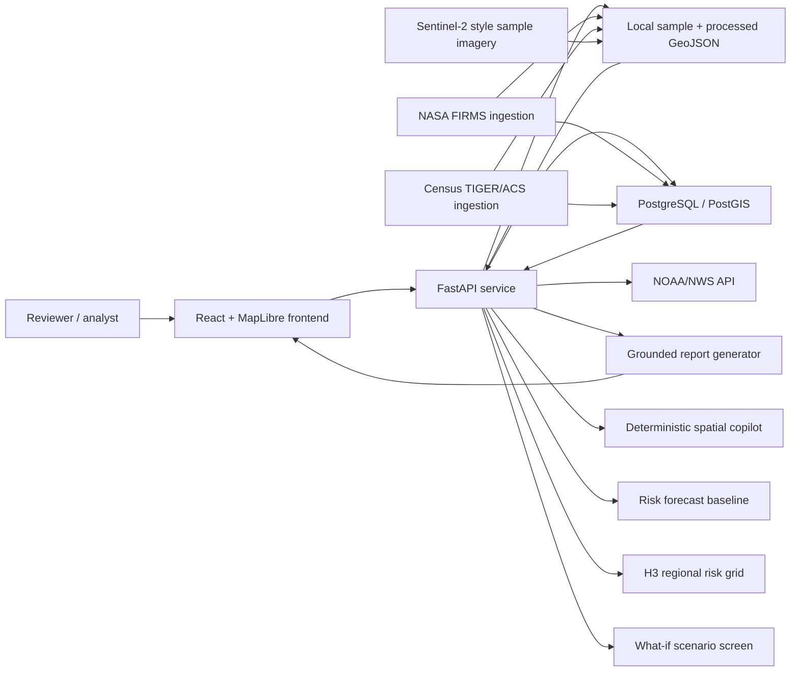

# Architecture

Wildfire GeoAI is a map-first decision-support system. The current build is Southwest-capable while preserving the original Arizona-first demo path.

## Runtime Services

- Frontend: React, Vite, MapLibre GL, Nginx in Docker.
- Backend: FastAPI with GeoJSON APIs, file fallbacks, PostGIS queries, weather context, report generation, and imagery metadata.
- Database: PostgreSQL/PostGIS for fire detections, county boundaries, exposure rows, places, regions, and H3 risk cells.
- Data files: sample and processed data under `data/`.

## Current Data Flow

1. FIRMS detections are loaded from sample GeoJSON, processed live FIRMS GeoJSON, or PostGIS.
2. County boundaries come from sample GeoJSON or PostGIS.
3. Incident clusters are computed from fire points by space/time proximity.
4. Exposure summaries combine clusters with county exposure and nearby places.
5. Weather context is fetched from NWS by incident centroid and cached locally.
6. Grounded reports convert structured incident summaries into prose without adding unsupported claims.
7. Risk grid cells score recent detections, intensity, historical priors, and exposure proxies.
8. Risk diagnostics expose proxy evaluation metrics for model transparency.
9. Spatial copilot converts supported natural-language queries into overlays and grounded summaries.
10. Forecast baseline produces 24/48/72-hour grid trend layers.
11. Satellite analysis serves sample before/after imagery and a burn scar polygon overlay.
12. Region config scales the app across AZ, CA, NV, NM, TX, CO, and Southwest.
13. H3 risk cells provide scalable regional aggregation and rankings.
14. What-if scenarios reweight temperature, drought, and wind assumptions over the H3 grid.

## Key API Surface

- `GET /health`
- `GET /api/fires`
- `GET /api/counties`
- `GET /api/fires/clusters`
- `GET /api/incidents/{incident_id}/summary`
- `POST /api/reports/incident`
- `GET /api/risk/grid`
- `GET /api/risk/evaluation`
- `GET /api/regions`
- `GET /api/risk/h3-grid`
- `POST /api/simulations/risk-scenario`
- `GET /api/forecast/risk-grid`
- `POST /api/copilot/query`
- `GET /api/imagery/search`
- `GET /api/imagery/{incident_id}/before-after`

## Deployment Shape

For local portfolio review:

- `docker compose up --build`
- Frontend: `http://127.0.0.1:8080`
- Backend: `http://127.0.0.1:8000`

For cloud deployment:

- Host the frontend as static assets behind Nginx or a static platform.
- Run the backend as a container service.
- Use managed Postgres with PostGIS enabled.
- Store large raster products in object storage rather than the repo.
